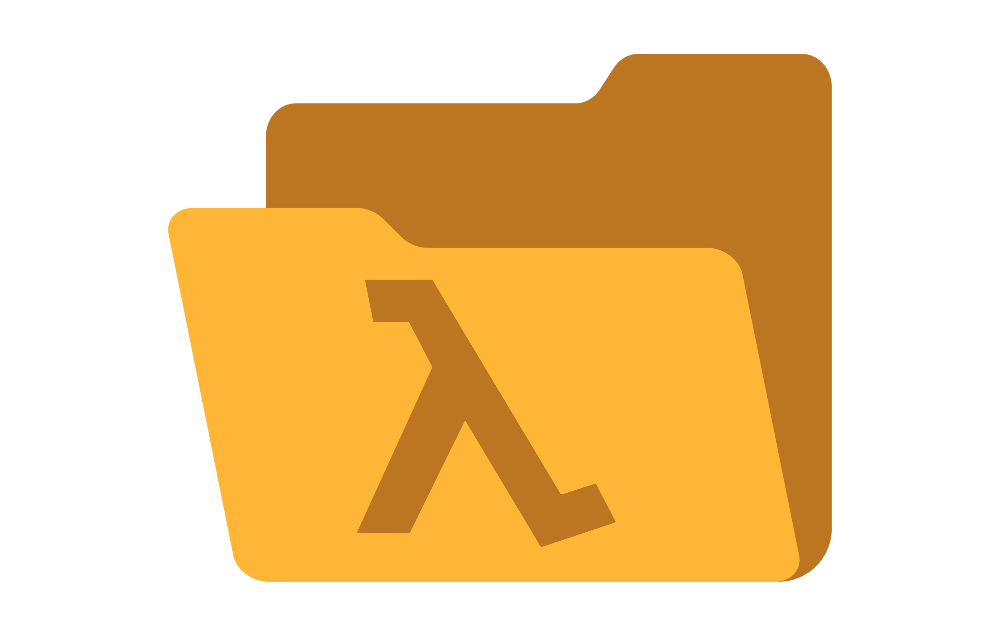

# Lambdirs

A fully serverless cloud storage solution.

- Endpoint authentication with AWS Cognito (OCID).
- File storage with S3, secured with pre-signed URLs and IAM policies.
- Managed using IaC (OpenTofu), supporting endpoint versioning, rollbacks, and
  automated deployments.
- Multi-enviroment support (dev/stage/prod).
- No need for fancy serverless frameworks or SAM. Just plain OpenTofu resources.

## Quick start

Refer to the [Deployment Guide](./opentofu/README.md) for instructions on how to
deploy the project using your AWS Free Tier.

## References

- <http://developer.hashicorp.com/terraform/tutorials/aws/lambda-api-gateway>
- <https://docs.aws.amazon.com/lambda/latest/dg/welcome.html>
- <https://registry.terraform.io/providers/hashicorp/aws/2.33.0/docs/guides/serverless-with-aws-lambda-and-api-gateway>
- <https://chatwithcloud.ai/aws-practical-examples/create-presigned-s3-url-for-uploading-using-aws-sdk-v3-for-js-and-ts>
